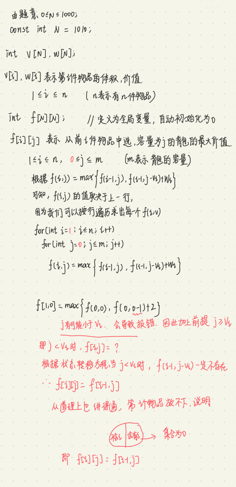

dp

[什么是动态规划（Dynamic Programming）？动态规划的意义是什么？ - 知乎 (zhihu.com)](https://www.zhihu.com/question/23995189)

有N件物品和一个容量为V的背包。第i件物品的体积是v[i]，价值是w[i]。求解将哪些物品装入背包可使价值总和最大。


1. 这是个最优解问题
2. 观察是否满足最优子结构，即大问题的最优解可以由小问题的最优解推导出

**注意$i$的取值是从1开始的，不是从0，因为从1比从0好分析。**

1. 定义最优解。从前$i$个物品中选，塞入容量为$v$的背包的最大价值$f(i,v)$
2. 大问题的最优解如何由小问题的最优解推导？我们站在集合的角度思考。

思考  **从前$i$个物品选，塞入容量为$v$的背包直至不能再塞**  有哪些可能的选择方案？

我们一定是 求出这些方案中每一个方案的价值，然后进行比较，得出最大价值$f(i,v)$ 

**我们把 从前$i$个物品选，塞入容量为$v$的背包直至不能再塞 的所有选择方案 看作是一个集合，把 所有方案的价值的最大值 作为 这个集合的最大价值。**

我们把这个集合按照某一条件进行划分，划分成小的集合。换句话说，将所有的选择方案按照某种条件进行划分。分别求每一个小集合的最大价值，然后再取这些集合的最大价值，作为大集合的最大价值。为什么要这样划分呢？因为大集合的所有方案我们不好暴力枚举，通过多次划分成小集合，直到最后每一个集合包含一种选择方案。

如果不好理解，我们举一个具体的例子来看，看能不能根据例子理解上面的思路。


DP算法的关键就在于：

1. 如何定义最优解或状态
2. 如何找到状态转移方程

怎么写代码呢？

第一种方法：使用dp二维数组



```cpp
#include <iostream>
#include <algorithm>   //引入max函数

using namespace std;

const int N = 1010;
int v[N],w[N];
int f[N][N];

int main()
{
    int n,m;
    cin >> n >> m;
    for(int i = 1;i <= n;i++) cin >> v[i] >> w[i];
    for(int i = 1;i <= n;i++)
    {
        for(int j = 0;j <= m;j++)
        {
            if(j < v[i]) f[i][j] = f[i-1][j];
            else f[i][j] = max( f[i-1][j],f[i-1][j-v[i]]+w[i] );
        }
    }
    cout << f[n][m];
}
```

空间优化为一维数组：

根据二维数组的方法思路，我们是按行遍历，求出每一个$f[i][j]$。因为我们想要的结果是二维矩阵的最后一个值即$f[n][m]$ ,而且，我们每一层的值只取决于上一层，我们可以用一个一维数组来存储上一层的$f值$，然后在这个数组上进行更新，这样做的好处是优化了空间。更新方程式是 $f[j] = max( f[j],f[j-v[j]]+w[j] )$ 

更新后的$f[j]$是当前层的，它的取值取决于上一层的$f[j],f[j-v[j]]+w[j]$。

如果依旧是按照从左往右的顺序进行更新的话，就会发现一个问题，对于任意一个$f[j]$来说，左边是已经更新过的，右边是还没更新的，左边已经更新了说明已经存放的是当前层的值了，当我们要更新$f[j]$的时候会发现，$f[j]$存放的是上一层的值，但是$f[j-v[j]]$ 是位于$f[j]$左边的，已经被更新了。即$f[j-v[j]]$ 存放的是当前层的值。$f[j]$是取决于更新前的$f[j-v[i]]$存发的值的。

这该怎么办呢？我们可以按照右往左的顺序更新，这样就没问题了。因为右边是更新的，左边没更新，我们更新的时候，是依赖于左边的，而左边没更新，还是上一层的值，这样正好。

再进行优化，在上面二维数组的代码中， `if(j < v[i]) f[i][j] = f[i-1][j];` ,意思是当 `j<v[i]`时，$f[j-v[j]]$是不存在的，在我们从右往左更新的时候，当$j<v[i]$时，$f[j-v[j]]$同样不存在，即$f[i-v[j]]+w[j] = 0$,我们的更新方程就是 $f[j] = max( f[j],0 )=f[j]$,即当 `j<v[j]`时，上一层的$f[j]$就等于当前层的$f[j]$,那就不用更新了，所以，我们不仅要按照从右往左的顺序更新，而且只更新$j>=v[i]$的部分。

```cpp
#include <iostream>
#include <algorithm>

using namespace std;

const int N = 1010;

int n, m;
int v[N], w[N];
int f[N];

int main()
{
    cin >> n >> m;

    for (int i = 1; i <= n; i ++ ) cin >> v[i] >> w[i];

    for (int i = 1; i <= n; i ++ )
        for (int j = m; j >= v[i]; j -- )
            f[j] = max(f[j], f[j - v[i]] + w[i]);

    cout << f[m] << endl;

    return 0;
}
```

