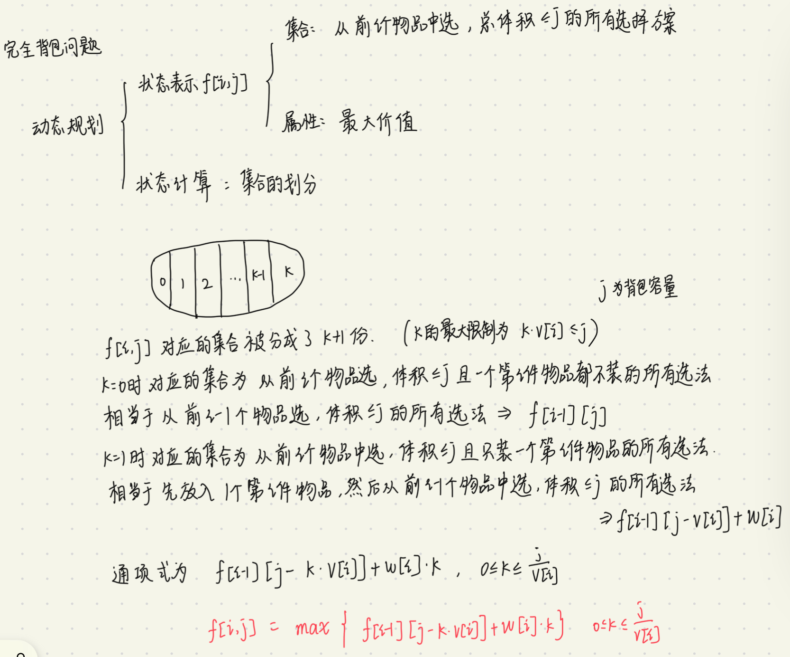

完全背包

有N种物品和一个容量为V的背包，每种物品都有无限件可用。第i种物品的体积是v[i]，价值是w[i]。求解将哪些物品装入背包可使这些物品的体积总和不超过背包容量，且价值总和最大。




以下代码省略了中间值MAX，算是对代码进行了改进。

二维数组实现：

```cpp
#include <iostream>
#include <algorithm>

using namespace std;

const int N = 1010;
int n,m;
int v[N],w[N];
int f[N][N];

int main()
{
    cin >> n >> m;
    for(int i = 1;i <= n;i++) cin >> v[i] >> w[i];
    for(int i = 1;i <= n;i++)
        for(int j = 0;j <= m;j++)
            for(int k = 0;k <= j/v[i];k++)
            {
                f[i][j] = max(f[i][j],f[i-1][j-k*v[i]]+w[i]*k);
            }
    cout << f[n][m];
}
```

因为三重循环，时间复杂度会比较高，算法题超时的可能性比较大，需要优化。


按照01背包的二维代码写就可以了。

```cpp
#include <iostream>
#include <algorithm>

using namespace std;

const int N = 1010;
int n,m;
int v[N],w[N];
int f[N][N];

int main()
{
    cin >> n >> m;
    for(int i = 1;i <= n;i++) cin >> v[i] >> w[i];
    for(int i = 1;i <= n;i++)
        for(int j = 0;j <= m;j++)
        {
            if(j<v[i]) f[i][j] = f[i-1][j];
            else f[i][j] = max( f[i-1][j],f[i][j-v[i]]+w[i]);
        }
    
    cout << f[n][m];
}
```

优化为一维数组

根据状态转移方程$f[i][j]=max( f[i-1][j],f[i][j-v[i]]+w[i] )$,如果用一维数组更新每一层的值的话，更新$f[j]$时，要看上一层的 $f[j]$ 和当前层的 $f[j-v[i]]$ ， $f[j-v[i]]$在 $f[j]$在左边，我们要想更新 $f[j]$，一定是先更新$f[j]$左边，然后才能更新。因此，我们的更新顺序是从左往右的。

另一方面，当 $j<v[i]$的时候，$f[j]$的值只取决于 上一层的$f[j]$，意思就是说，对于 $j<v[i]$的部分完全没有必要更新，直接从$j>v[i]$开始就好了。

```cpp
#include <iostream>
#include <algorithm>

using namespace std;

const int N = 1010;
int n,m;
int v[N],w[N];
int f[N];

int main()
{
    cin >> n >> m;
    for(int i = 1;i <= n;i++) cin >> v[i] >> w[i];
    for(int i = 1;i <= n;i++)
        for(int j = v[i];j <= m;j++) 
            f[j] = max( f[j],f[j-v[i]]+w[i]);
    cout << f[m];
}
```


