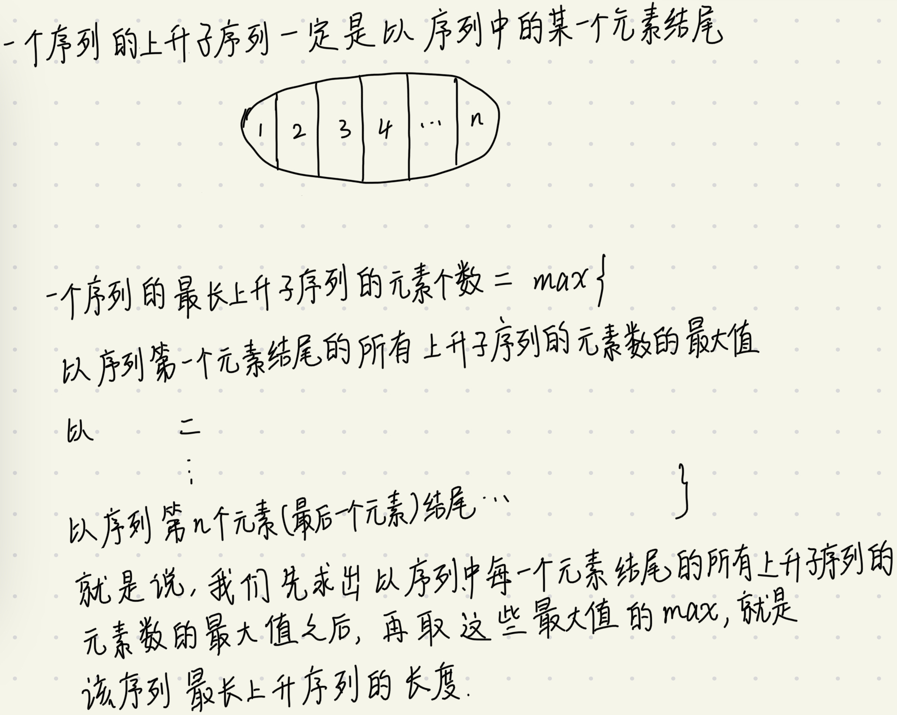
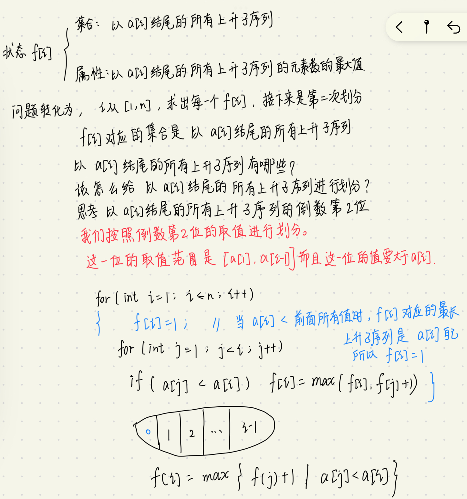

最长上升子序列(Longest  Increasing Subsequence,**LIS**)

子串和子序列的区别：

1. 一个序列的子串是指连续的一串元素
2. 在数学中，某个序列的子序列是从最初序列通过去除某些元素但不破坏余下元素的相对位置（在前或在后）而形成的新序列


一个序列的一个上升子序列是指，元素值按照位置先后的顺序递增。

一个序列的一个最长上升子序列是指，在该序列的所有上升子序列中，元素个数最多的上升子序列。最长上升子序列并不唯一，因为可能有多个上升子序列的元素个数都是最大值。




整体思路👆，这个整体思路与数字三角形是一样的。先进行初次划分，分别求每一个划分。

这个划分就是我们接下来定义的状态。

如何求以序列中每一个元素结尾的所有上升子序列的元素数的最大值呢？



总结一下，总共进行了两次划分，第一次划分来确定状态；第二次划分确定状态转移方程。数字三角形这道题也是一样的。


```cpp
#include <iostream>
#include <algorithm>

using namespace std;

const int N = 1010;
int f[N],a[N];
int n;

int main()
{
    cin >> n;
    for(int i = 1; i <= n; i++) cin >> a[i];
    for(int i = 1; i <= n; i++)
    {
        f[i] = 1;
        for(int j = 0; j < i;j++)
        {
            if(a[j] < a[i]) f[i] = max(f[i],f[j]+1);
        }
    }
    int res = 0;
    for(int i = 1; i<= n; i++) res = max(res,f[i]);
    cout << res;
}
```


如何求最长上升子序列？

存储每一步取最大值的f[i]对应的a[i]就可以了。

