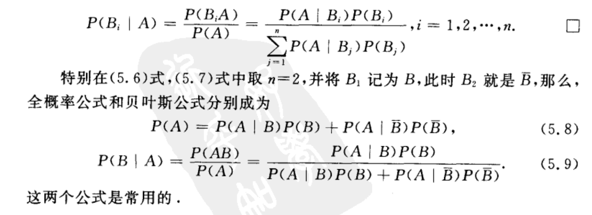
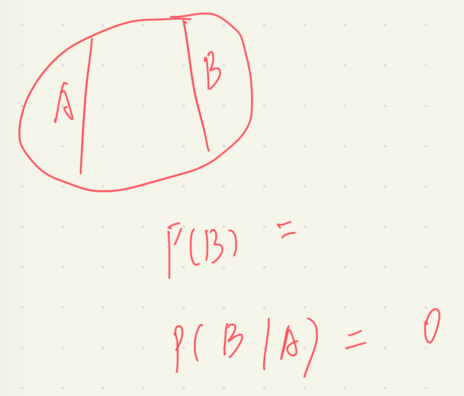
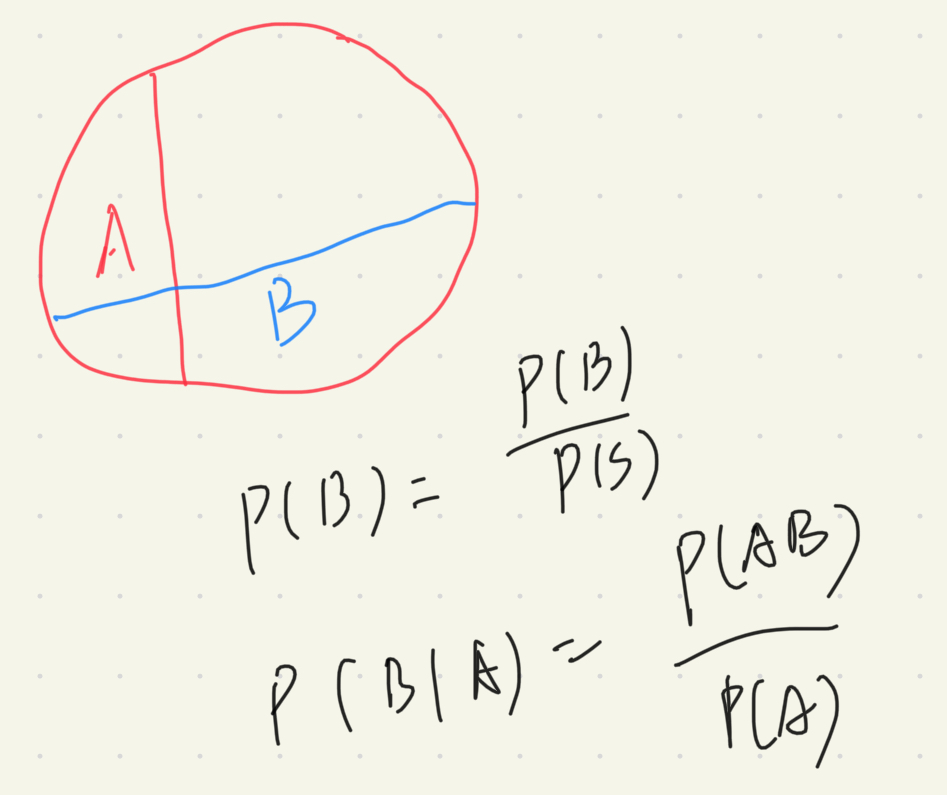

# 第一章 概率论的基本概念

自然界和社会上发生的现象是各种各样的，有一类现象，在一定条件下是必然发生的，比如，向上抛石子，必然下落；同性电荷必然排斥，这类现象称**确定性现象**；还有一类现象，在一定条件下，可能会产生这样的结果或那样的结果，比如，抛一枚硬币，有可能正面朝上，也有可能反面朝上；这类现象经过人类长期实践并深入研究之后，发现这类现象在大量重复试验或观察下，它的结果呈现出某种规律性。比如，多次重复抛一枚硬币，发现正面朝上大致有一半。这种结果不确定的现象，经过大量试验或观察后呈现出的固有规律性，称**统计规律性**。这种现象称**随机现象**。

**概率论与数理统计就是研究随机现象统计规律性的一门数学学科**

> 概念需要记忆

## 概念一：随机试验

随机试验的三个特点：

1. 可以在相同条件下重复进行
2. 每次试验的可能结果不止一个，且事先知道试验所有可能的结果
3. 进行一次试验前不能确定哪一个结果会出现

## 概念二：样本空间和随机事件

随机试验$\pmb{E}$所有可能结果的集合称为样本空间$\pmb{S}$,每一个可能的结果称为样本点

在实际中，进行随机试验时，人们常常关心的是满足某种条件的样本点的集合。举个例子，试验$\pmb{E}$:在一批灯泡中随机抽取一只，测试它的寿命$t$。样本空间$\pmb{S} = \lbrace t\geqslant 0\rbrace$；如果规定$t\geqslant 500$为合格的灯泡，那么根据是否满足条件将样本点分成两部分；满足$t \geqslant 500$这个条件的样本点集合，我们称它为试验$\pmb{E}$的一个随机事件。

随机事件原书中的概念：

我们称试验 $\pmb{E}$ 的样本空间$\pmb{S}$ 的子集为 $\pmb{E}$ 的**随机事件**，简称**事件**。

我觉得这样的概念虽然没错，但是并不利于理解，倒不如解释成，**试验$ \pmb{E} $的样本空间$\pmb{S}$ 中满足某种条件的样本点的集合。**随机事件这个概念只有在具体问题中才有意义。

随机事件的关键因素：

1. 提到随机事件时，一定要想到是关于哪个随机试验的随机事件

2. 随机事件满足了什么条件，或者说，随机事件包含哪些样本点。

3. 一个划分条件可以将样本空间划分成一组随机事件，因此当有多个划分条件的时候，每一个划分条件都会将样本空间划分成一组随机事件。

   举个例子，？？？

**在每次试验中，一个随机事件中如果有样本点发生了，就说这个随机事件发生了。**

这个也很好理解，比如：

试验$\pmb{E}$:在一批灯泡中随机抽取一只，测试它的寿命$t$。样本空间$\pmb{S} = \lbrace t\geqslant 0\rbrace$；如果规定$t\geqslant 500$为合格的灯泡；定义满足$t \geqslant 500$ 这个条件的事件$\pmb{A}$ 。在一次试验中，测得灯泡的寿命$t = 650$ ，我们就说事件$\pmb{A}$ 发生了。 

由一个样本点组成的子集，称为**基本事件**

样本空间$\pmb{S}$ 本身是自己的子集，样本空间$\pmb{S}$ 称必然事件

空集$\varnothing$ 是样本空间$\pmb{S}$ 的子集，空集$\varnothing$ 称不可能事件

## 事件间的关系与事件运算

随机试验$\pmb{E}$ 的随机事件$\pmb{A},\pmb{B}$

1. 若$\pmb{A} \sub \pmb{B}$ ,称事件$\pmb{A}$ 含于 事件$\pmb{B}$ ----->事件$\pmb{A}$ 发生必然导致事件$\pmb{B}$ 发生
2. 若$\pmb{A} \sub \pmb{B}$ 且 $\pmb{B} \sub \pmb{A}$ ，称事件$\pmb{A}$ 与事件$\pmb{B}$ 相等
3. 若$\pmb{A} \cup \pmb{B}$ ,称事件$\pmb{A}$ 与事件$\pmb{B}$ 的和事件-------->$\pmb{A},\pmb{B}$至少有一个发生，$\pmb{A} \cup \pmb{B}$ 发生。
4. 若$\pmb{A} \cap \pmb{B}$ ,称事件$\pmb{A}$ 与事件$\pmb{B}$ 的积事件-------->$\pmb{A},\pmb{B}$同时发生，$\pmb{A} \cap \pmb{B}$ 发生。$\pmb{A} \cap \pmb{B}$ 常写作AB
5. 事件$\pmb{A}-\pmb{B}$ ,称事件$\pmb{A}$与事件$\pmb{B}$ 的差事件------->当且仅当 $\pmb{A}$ 发生，$\pmb{B}$ 不发生，$\pmb{A}-\pmb{B}$ 发生
6. 若$\pmb{A} \cap \pmb{B} = \varnothing$ ,称事件$\pmb{A}$ 与事件$\pmb{B}$ 互不相容或互斥------>$\pmb{A},\pmb{B}$ 不可能同时发生
7. 若$\pmb{A} \cup \pmb{B} = \pmb{S}$ 且$\pmb{A} \cap \pmb{B}=\varnothing$ ,$\pmb{A}$与$\pmb{B}$ 互为逆事件，或对立事件；$\pmb{A}$的互逆事件$\bar{A}$

交换律:    $A ∪ B = B ∪ A $ ;$A ∩ B = B ∩ A$

结合律:     $A∪(B∪C)=(A∪B)∪C$;$(A∩B)∩C=A∩(B∩C)$

分配律:     $A∩(B∪C)=(A∩B)∪(A∩C)$;$A∪(B∩C)=(A∪B)∩(A∪C)$

德摩根律:  $\overline{\pmb{A} \cup \pmb{B}}=\bar{A}\cap\bar{B}$ ;$\overline{\pmb{A} \cap \pmb{B}}=\bar{A}\cup\bar{B}$

## 频数与频率

在相同的条件下，进行了n次试验，事件$\pmb{A}$ 发生了$n_A$次，称事件$\pmb{A}$ 发生的频数；$\frac{n_A}{n}$称事件$\pmb{A}$ 的频率；随着n的增大，频率逐渐趋于稳定，就是统计出的规律了。

在实际中，我们不可能对所有事件都做大量的试验来求得事件发生的频率，用以表示事件的发生的可能性大小；但为了理论研究的需要，我们定义了概率

## 概率

随机试验$E$ ，样本空间$S$ ，对于$E$的每一个事件$A$赋予一个实数,记为$p(A)$ ，称事件$A$发生的概率；

概率的定义：

1. 非负性：对于每一个事件$A$,$p(A)\geqslant 0$ ---->概率不可能是负数

2. 规范性: 对于必然事件$S$,有$p(S)=1$

3. 可列可加性：如果事件$A_1 \cap A_2\cap A_3\cap ...=\varnothing$ ,即事件之间没有交集，那么$p(A_1\cup A_2\cup A_3\cup...)=P(A_1)+P(A_2)+P(A_3)+P(...)$

   意思就是，**事件之间没有交集的话，那么它们的并集的概率等于各个事件概率的和**

性质：

1. $P(\varnothing)=0$
2. 若$A \sub B$ ，差事件$B-A$的概率$P(B-A)=P(B)-P(A)$ 
3. 对于任意事件$A$ ，$P(A)\leq 1$ 
4. $P(\bar A)=1-P(A)$
5. $P(A \cup B)=P(A)+P(B)-P(A \cap B)$

如何理解？

把事件$A$想成事件$A$包含的样本点，事件$B$想成事件$B$包含的样本点，每一个样本点都有一个概率；

若$A\sub B$,求$P(B-A)$的话，就是求事件$B$的样本点减去事件$A$的样本点，剩下的样本点的概率,就是用$B$所有样本点的概率减去$A$所有的样本点

任何问题都可以想成样本点之间的抵消与合并

### 等可能概型

1. 试验的样本空间包含有限个元素
2. 试验中的每个基本事件发生的可能性相同

公式1：$$试验E的样本空间S={e_1,e_2,...,e_n},P(e_1)=P(e_2)=P(...)=P(e_n)$$

公式2: $$P(e_1)+P(e_2)+...+P(e_n)=1$$

公式3:$$若事件A包含k个样本点,则P(A)=\frac{k}{n}$$

### 条件概率

$P(B|A)$表示在事件$A$已经发生的情况下，事件$B$发生的概率.

从样本点的角度考虑，事件$A$已经发生，说明了，**有一个属于事件$A$的样本点已经发生了**，哪一个样本点都有可能发生，我们现在先假设，**事件A所有的样本点发生的可能性都相同**，虽然不确定是哪一个，但是**考虑的范围一定在事件$A$这个集合中**，要求的是事件$B$ 发生的可能性，事件$B$要想发生，必须是属于事件$B$的样本点发生了；现在已知的是 事件$A$中的样本点已经发生了，如果事件$A$和事件$B$ 要是没有交集，即没有公共的样本点，这两个事件就不可能同时发生，$P(B|A)$就为0；如果有公共样本点，那$P(B|A)=\frac{n_{AB}}{n_A}$,即公共样本点与A的样本点的比值。

注意：因为我们假设事件$A$所有的样本点发生的可能性都相同，才能说$P(B|A)=\frac{n_{AB}}{n_A}$ ；

如果没有这个假设，我们只能说$P(B|A)=\frac {P(AB)}{P(A)}$ 

**别忘了，每一个样本点都是有概率的。**

其实条件概率只是将原来的样本空间缩小成了事件$A$(注意事件$A$是一个样本点集合);

条件概率也符合概率的定义：

1. 非负性：对于**每一个**事件$B$,$P(B|A)\geq 0$----->想成事件$A$和事件$B$的交集样本点，这部分样本点的概率和比上事件$A$的样本点的概率和；
2. 规范性:即$P(A|A)=1$
3. 可列可加性:对于互不相容的事件$B_1,B_2$,有$P(B_1|A)+P(B_2|A)=P(B_1 \cup B_2|A)$

并不难理解，唯一变了的地方就是，样本空间成了事件$A$

**注意：提及$P(B|A)$的时候，可以想成在事件$A$的范围内，找到事件$A$和事件$B$的交集，这部分交集比上整个$A$**

**提及$P(A),P(B)$时，还是以整个样本空间为基础进行考虑** 

划分:

试验$E$的样本空间$S$，一组事件$B_1,B_2,...$ 将样本空间进行划分，即各不相交且并起来是整个样本空间

与条件概率有关的公式：

1.乘法原理：$P(AB)=P(B|A)*P(A)$

- $P(ABC)=P(C|AB)*P(B|A)*P(A)$

可以理解成$P(ABC)=P(C|AB)*P(AB)$

2. 全概率公式:试验$E$的样本空间$S$的一组划分$B_1,B_2,...$，和试验$E$的一个事件$A$，满足如下公式：

$P(A)=P(A|B_1)+P(A|B_2)+p(A|...)$

脑子里想图像，很容易理解

3. 贝叶斯公式(Bayes)：由全概率公式和条件概率的定义推导出的式子

看5.9，分子是乘法原理，分母是全概率公式

放回抽样和不放回抽样；

**先验概率：指根据以往经验和分析(根据计算的概率分布)。在实验或采样前就可以得到的概率。**

**后验概率：已知某事件已经发生，求在事件已经发生的情况下，某些事件的概率，就是条件概率**

### 独立性

设事件$A,B$是试验$E$的两个事件，若$P(A)\geq 0$,可以定义$P(B|A)$ ,一般，A的发生对B的发生是有影响的，即$P(B) \neq P(B|A)$ ；如果A的发生对B的发生没有影响，即$P(B|A)=P(B)$，说明事件$A,B$相互独立

需要强调一下：

1. 事件$A,B$必须是同一试验的两个事件

2. 证明两个事件是否是相互独立的，只需要看看是不是同一试验$E$的两个事件，等价来说，看看两个事件的样本空间是否一致；再分别求出P(B|A)和P(A)；看看两个是否相等，如果相等，就说明是相互独立的。
3. 我之前学习时的误区：认为事件$A,B$相互独立是指两个事件不相交，这种思想从高中贯穿至我的大二，直到大三考研时才明白，这种想法是完全错误的。再强调一遍：要证明两个事件是否是相互独立的，只要根据定义即可。

这里，为了证实我错误的思想，我把书中的例子抄上来以供理解。

例1：设试验$E$为“抛甲、乙两枚硬币，观察正反面出现的情况”，设事件$A$为“甲币出现$H$,事件$B$为“乙币出现$H$”,则试验$E$的样本空间$S=\lbrace HH,HT,TH,TT\rbrace$

现在证明事件$A$和事件$B$是否有独立性，已知事件$A,B$都是属于试验$E$的事件，ok，这个没问题；

$A=\lbrace HH,HT \rbrace$ 

$B=\lbrace HH,TH \rbrace$

略微思考一下，可知样本空间$S$的每一个样本点发生的可能性相同，即这是个古典概型

可求得$P(A)=\frac{1}{2}$,$P(B)=\frac{1}{2}$

要求$P(B|A)=\frac{P(AB)}{P(A)}$,

先求$P(AB)$指事件$A,B$同时发生的概率，事件$A,B$的交集只有一个$HH$,样本空间为$S$,又因为是等概率事件，所以$P(AB)=\frac{P(HH)}{P(S)}=P(HH)=\frac{1}{4}$  

所以$P(B|A)=\frac{P(AB)}{P(A)}=\frac{\frac{1}{4}}{\frac{1}{2}}=\frac{1}{2}$

可知，**$P(B|A)=P(A)$ ，即不管事件$A$发不发生，都不影响事件$B$发生的概率，这才是独立性的内在含义**，另一点，我们看，事件$A,B$是相互独立的，但是这两个事件都有一个共同的样本$HH$，这就说明，事件$A,B$相互独立并不是指两个事件不相交。

**根据图像来说明事件独立的几何意义**：

事件A和事件B没有交集，P(B|A) = 0，而P(B)不等于0，说明，如果事件A和事件B无交集，那么肯定不相互独立。

事件A与事件B有交集，要想P(B) = P(B|A)，只有事件B发生的概率占样本空间S的比例 =  事件AB发生的概率占样本空间A的比例。这样，事件A，B相互独立。

事件A，B相互独立的充要条件是P(AB) = P(A)P(B)

证明：事件A，B相互独立可以推出P(B) = P(B|A) = $\frac{P(AB)}{P(A)}$

因此，P(B)P(A) = P(AB)

与相互独立有关的定理：

1. 事件$A,B$如果相互独立，说明P(B|A)=P(B),反之亦然，即P(A|B)=P(A)
2. 若事件$A,B$相互独立，则对立事件也相互独立，即A和B，A和$\bar B$ ,$B$和$\bar A$ ,$\bar A$和$\bar B$都相互独立
3. 

第一章已经学完了，感觉我收获满满，即都能理解，而且解决了我多年的困惑，因为从高中就接触概率，但一直是不明不白，我悟出了一个道理，也是我从别的文章看到的，分享一下。

> 能自己看书悟化的内容是真正容进你血液里，而看视频只能停留在知识表象，一直在被动接受，缺乏主动思考的过程。视频虽然看的爽，但是看完不做题巩固，又会还给老师的。

虽然自己理解了，但并不代表真的理解了，需要大量做题，所以要练题的，这一步是不能省的。

