概率论三

### 二维随机变量

以上我们只限于讨论一个随机变量的情况,但在实际问题中,**对于某些随机试验的结果需要同时用两个或两个以上的随机变量来描述**.例如,为了研究某一地区学龄前儿童的发育情况,对这一地区的儿童进行抽查.对于每个儿童都能观察到他的身高H和体重W.在这里,样本空间S={e}={某地区的全部学龄前儿童},而H(e)和W(e)是定义在S上的两个随机变量.又如炮弹弹着点的位置需要由它的横坐标和纵坐标来确定，而横坐标和纵坐标是定义在同一个样本空间的两个随机变量.

设E是一个随机试验,它的样本空间是S={e},设X=X(e)和Y=Y(e)是定义在S上的随机变量,由它们构成的一个向量(X,Y )，叫做二维随机向量或二维随机变量。第二章讨论的随机变量也叫一维随机变量．

### 二维随机变量的分布函数

设(X,Y)是二维随机变量,对于任意实数x,y，二元函数:
$$
F(x,y)=P\{(X≤x)∩(Y≤y)\}=P\{X≤x,Y≤y\}
$$
称为二维随机变量(X,Y)的分布函数,或称为随机变量X和Y的联合分布函数.

$F(x,y)$的几何解释：

如果将二维随机变量(X,Y)看成是平面上随机点的坐标,那么,分布函数F(x, y)在(x, y)处的函数值就是随机点(X,Y)落在如图3一2所示的,以点(x，y)为顶点而位于该点左下方的无穷矩形域内的概率.

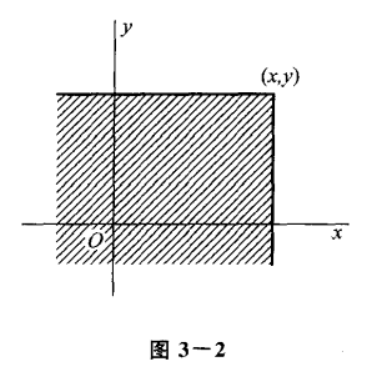

> 一维随机变量的分布函数也有几何意义：$F_X(x)$在$x_0$处的函数值就是随机点落在x轴<$x_0$的概率

下图对应的概率：
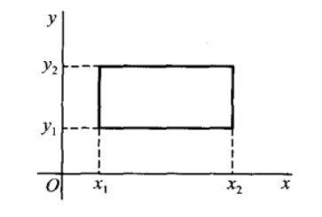
$$
P\{x_1<X \leq x_2,y_1<Y\leq y_2\}=
F(x_2,y_2)-F(x_1,y_2)-F(x_2,y_1)+F(x_1,y_1)
$$

### 二维随机变量的离散型及其分布律

如果二维随机变量(X,Y)全部可能取到的值是有限对或可列无限多对,则称(X,Y)是离散型的随机变量.

二维离散型随机变量的分布律

设二维离散型随机变量的所有可能的取值为$(x_i,y_j)$ $i,j =1,2,3,...$

规定$P(X=x_i,Y=y_j)=p_{ij}$

则分布律为

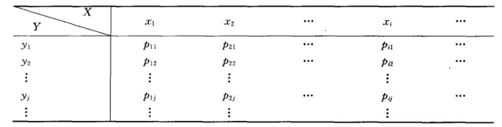

$p_{ij}$ 表示的含义是：$X=x_i$与$Y=y_j$ 同时发生的概率。

同一个样本空间S，有两种不同的划分标准X，Y，随机事件分别是$x_i,y_j$

`问一个问题：`

同时发生的概率=分别发生概率的乘积？即$p_{ij}=p(x_1)*p(x_2)$？

我们来看个例题来理解一下：

设随机变量X在1,2,3,4四个整数中等可能地取一个值,另一个随机变量Y在1～X中等可能地取一整数值.试求(X,Y)的分布律.
$P(X=1)=P(X=2)=P(X=3)=P(X=4)=\frac{1}{4}$

当X=1时，$P(Y=1)=1$

当X=2时，$P(Y=1)=P(Y=2)=\frac{1}{2}$

当X=3时，$P(Y=1)=P(Y=2)=P(Y=3)=\frac{1}{3}$

当X=4时，$P(Y=1)=P(Y=2)=P(Y=3)=P(Y=4)=\frac{1}{4}$

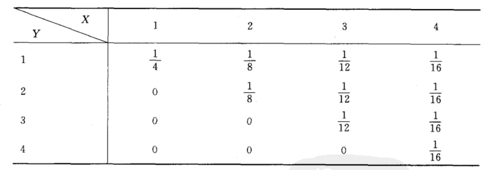

现在在来看看P(X)和P(Y)：
$P(Y=1)$可不是$1+\frac{1}{2}+\frac{1}{3}+\frac{1}{4}$

$P(Y=1)=P(X->\infty,Y=1)$对应的是表格中$Y=1$那一行所有元素的和$P(Y=1)=\frac{1}{4}+\frac{1}{8}+\frac{1}{12}+\frac{1}{16}$

思考一：
二维分布律的X，Y可能是独立的，如最上面提到的学生的体重和身高，或者是坐标(x,y)

也有可能跟这个例题里的X，Y一样，是有关系的。

思考二：

$P_{ij} \neq P(X=x_i)*P(Y=y_j)$

只有当X，Y独立的时候才等于。。。。这是`独立`部分的内容

思考三：
一定要按照定义来，要理解透定义。

二维离散型随机变量的分布函数
$$
F(x,y)=\sum_{x_i<x}\sum_{y_j<y}p_{ij}
$$

### 二维随机变量的连续型及其概率密度函数

如果存在**非负可积**函数f(x, y)，使对于任意x,y都有
$$
F(x,y)=\int_{-\infty}^{x}\int_{-\infty}^{y}f(u, v)dudv
$$

则称(X,Y)是连续型的二维随机变量，函数f(x,y)称为二维随机变量(X,Y)的概率密度，或者称为随机变量X和Y的联合概率密度.

用我的话来说，就是存在一个非负可积的函数，使得该函数与这部分面积的乘积=$F(x,y)$

这部分面积指的是xoy平面内，($-\infty,x$)($-\infty,y$)

注意是如何定义的二维连续型随机变量：只要能找到/存在非负可积函数f(x,y)满足上面那个式子，我们就说x，y是

二维连续型随机变量。

举个例子：

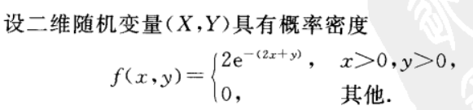

如果要求$F(Y\leq X)$

如何求呢？

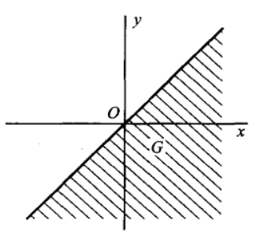

相当于求这部分面积的概率密度函数的不定积分

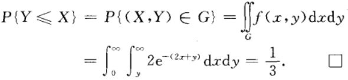

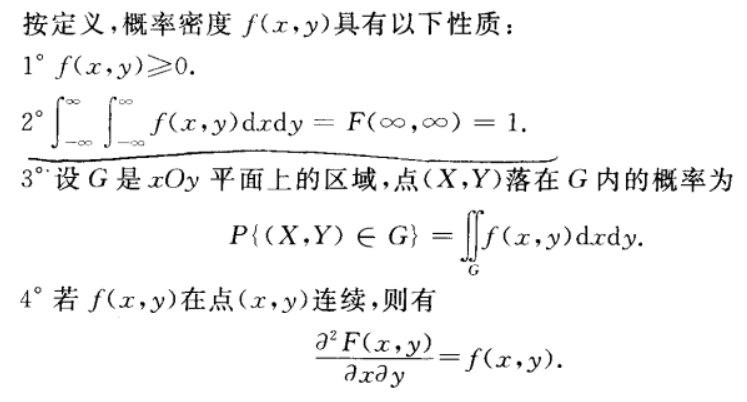

### 边缘分布&边缘概率密度

二维随机变量(X,Y)作为一个整体,具有分布函数F(x,y),而X和Y都是随机变量，各自也有分布函数,将它们分别记为$F_X(x)，F_Y(y)$，依次称为二维随机变量(X,Y)关于X和关于Y的边缘分布函数.边缘分布函数可以由(X,Y)的分布函数F(x, y)所确定.

通过学习定义，我有以下的理解：

对于一个二维离散型随机变量，如果X，Y是独立的，那么就相当于，两个一维离散型随机变量求各自的分布律。

如果X，Y不是独立的，那就要根据
$$
P_X(x)=P\{X\leq x\}=P\{X\leq x,Y\leq \infty\}
$$
这个式子来分别求$P_X(x),P_Y(y)$

对应的也就是二维分布律的一行或一列。

总的来说，如果是离散型随机变量，可以先画出二维分布律，在按行，列求即可。

如果是二维连续型随机变量呢？
二维连续型随机变量一般都是给概率密度函数或者是分布函数。一般不会求边缘分布，而是求边缘概率密度👇

连续型随机变量的边缘概率密度

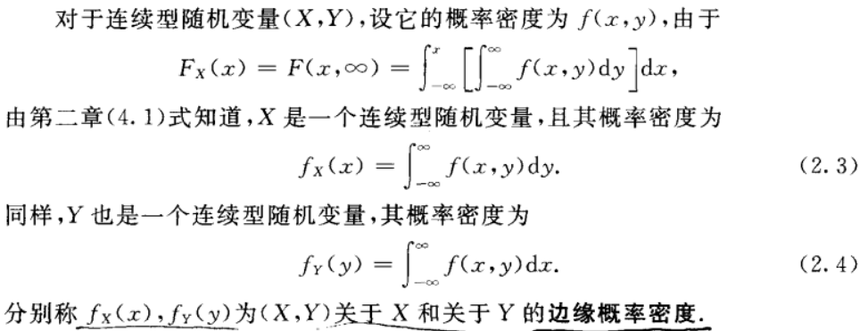

$$
F_X(x)=\int_{-\infty}^x[\int_{-\infty}^{\infty}f(u,v)dv]du
$$
对$F_X(x)$关于求x的偏导，结果就是$f_X(x)$，即关于X的边缘概率密度。

即
$$
f_X(x)=\int_{-\infty}^{\infty}f(x,v)dv
$$
这是一个关于x的函数

一会看例题

例题：

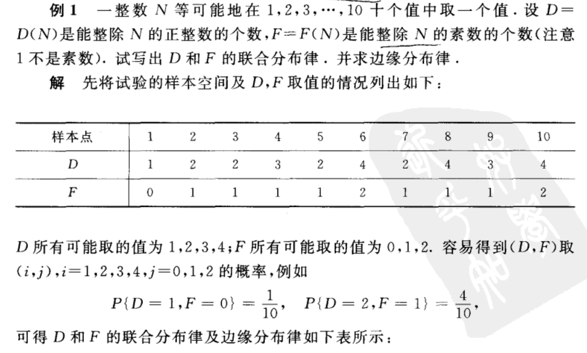

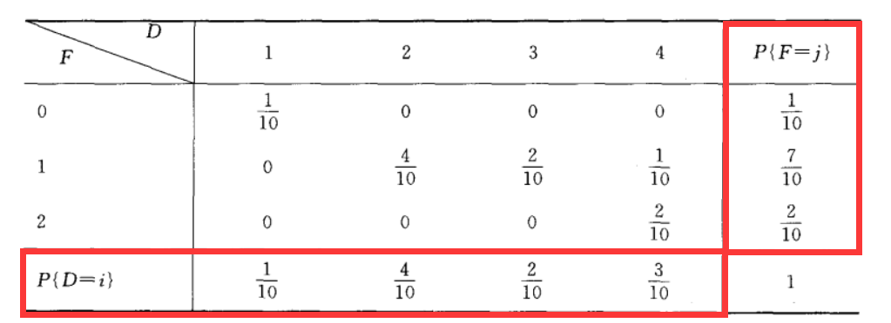

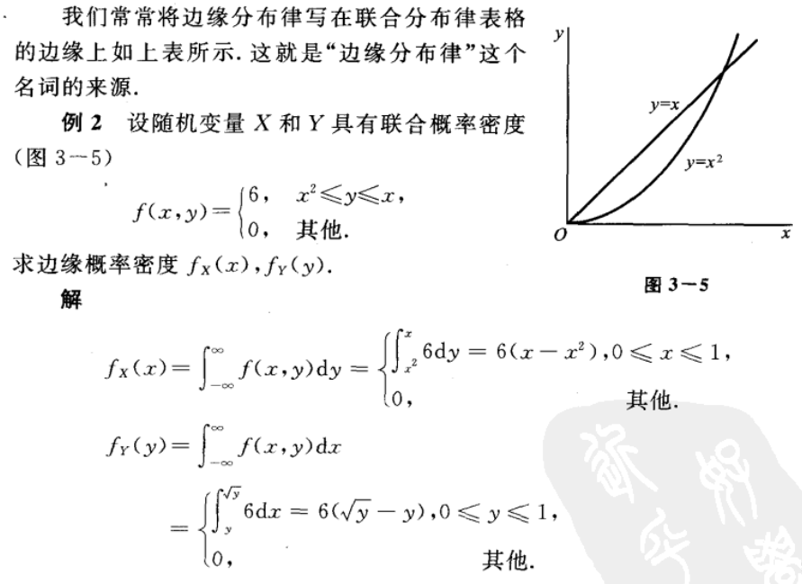

某书上说是为了方便排版和让排版好看些，经常把e^f（x）写成exp（f（x））

看下面这个题：

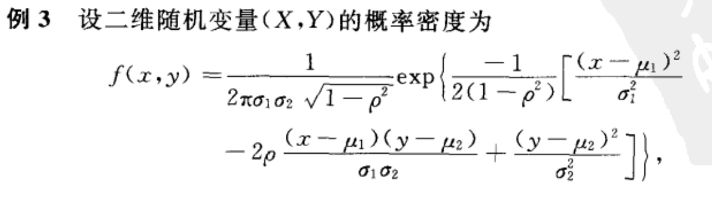

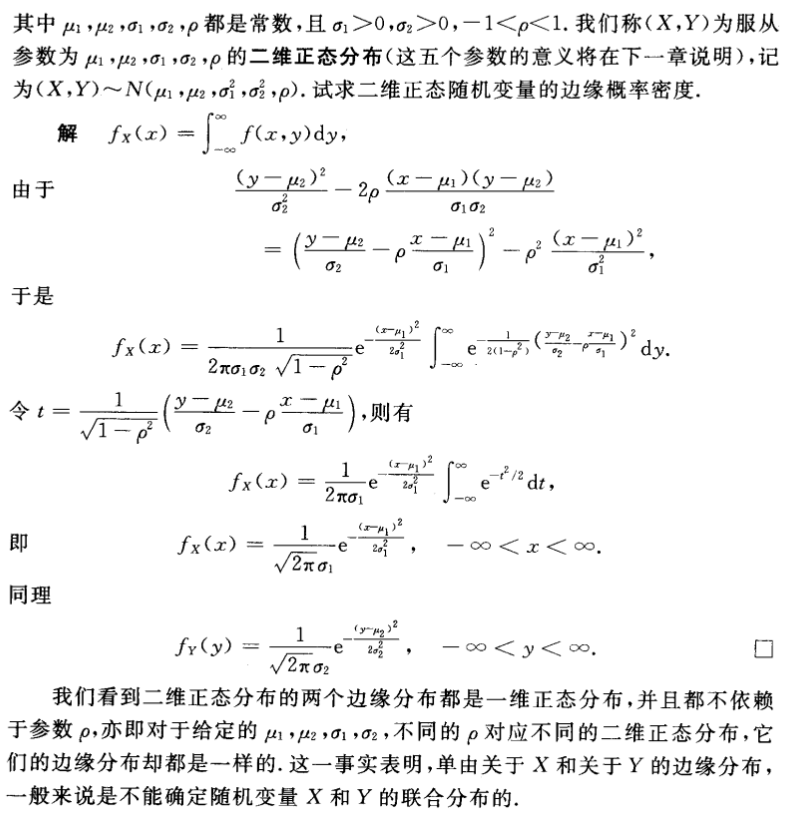

对比一维的正态分布

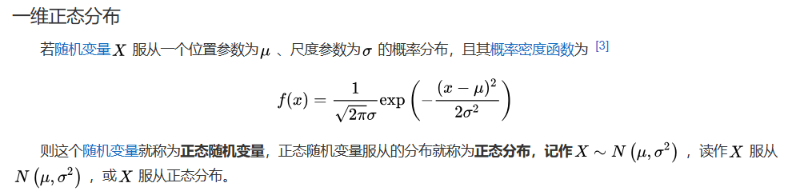

### 条件分布&条件概率密度

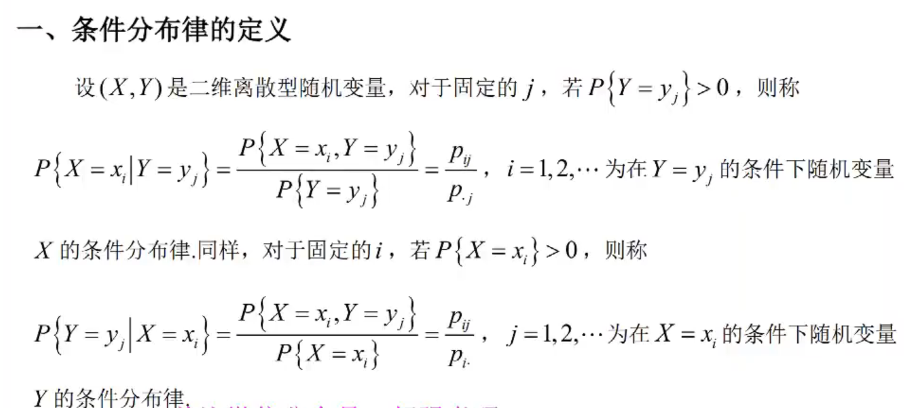

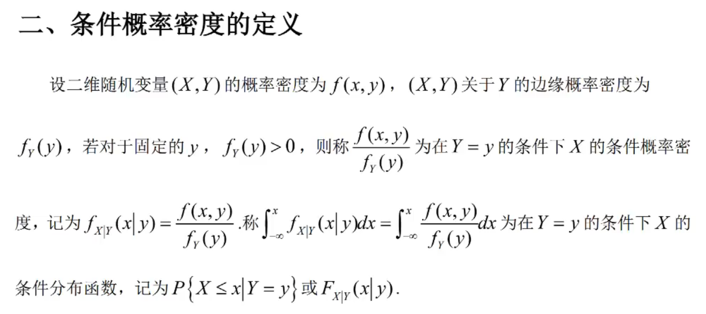

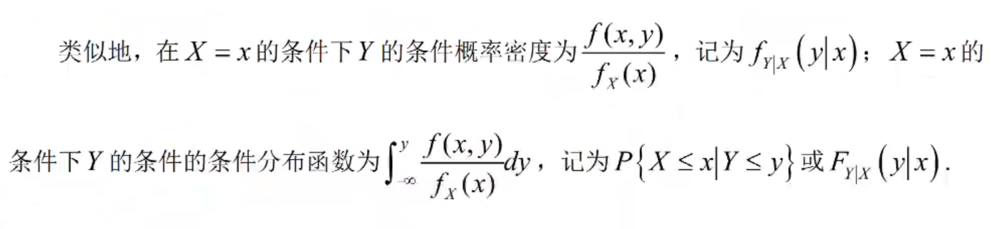

两个重要的二维连续型随机变量

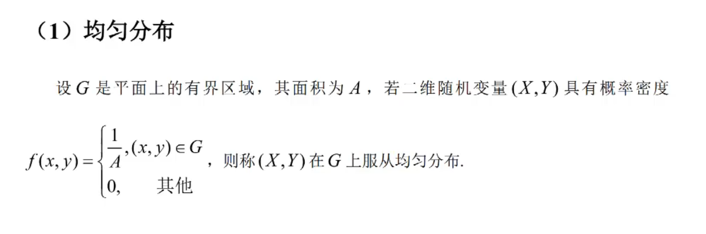

记为$(x,y)\sim N(G)$

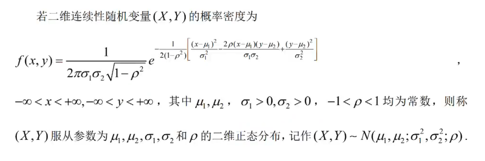

<video src="12.3.3条件分布- 公号：李颜控.mp4"></video>

### 相互独立的随机变量

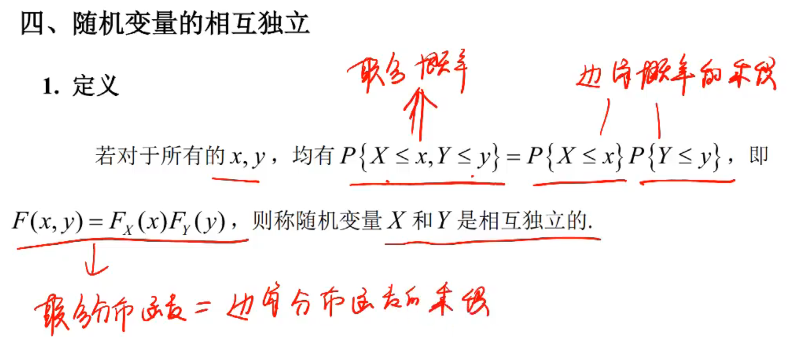

这就是我之前的思考。

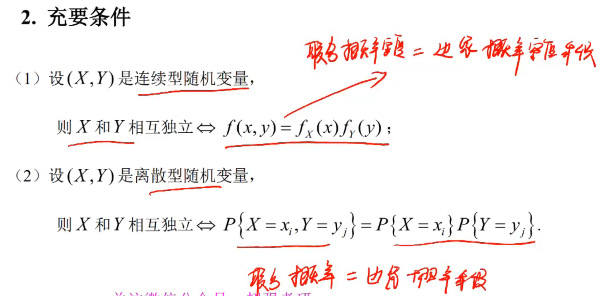

这是由独立性的概念推理出来的。

### 两个二维随机变量的函数的分布

省略