概率论四

随机变量的数字特征

## 数学期望

### 一维随机变量

#### 离散型随机变量的数学期望

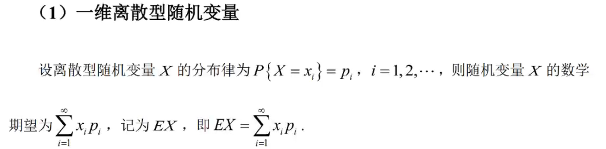

什么是离散型随机变量？

1. 有限的取值
2. 可列无限的取值

因此知道这里为什么是$\infty$了吧

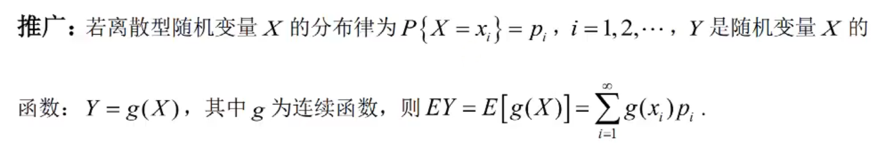

#### 连续型随机变量的数学期望

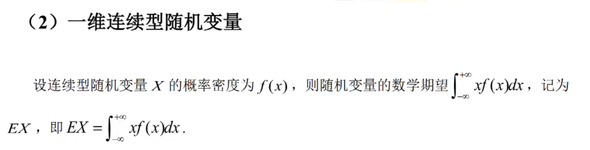

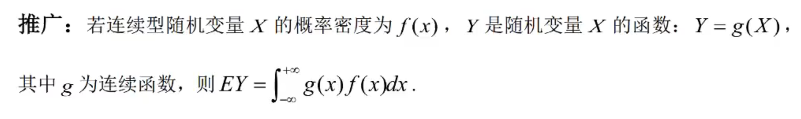

两个例子很重要

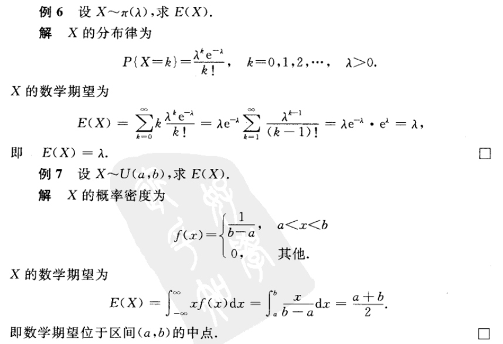

涉及无穷级数的概念（高数部分）

### 二维随机变量

#### 二维连续型随机变量的数学期望

没有讲二维离散型随机变量的数学期望。。

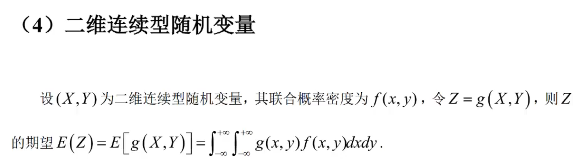

<video src="11.3.2边缘分布- 公号：李颜控.mp4"></video>

### 性质

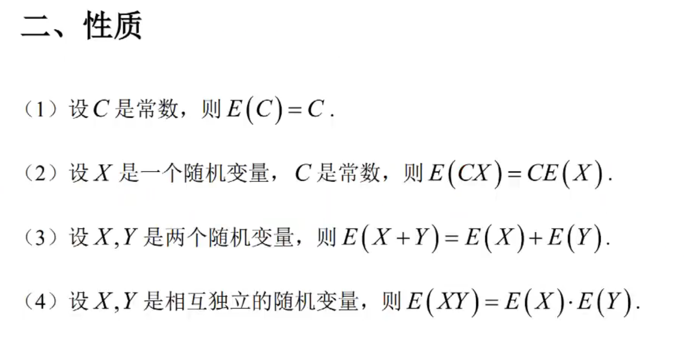

## 方差

### 定义

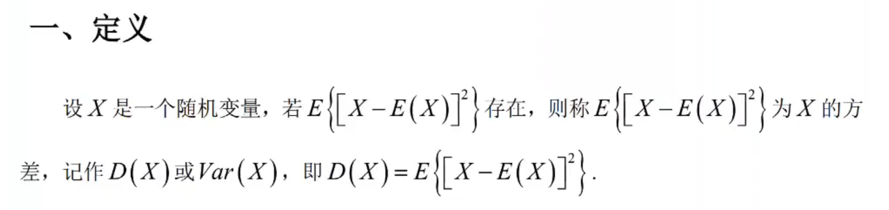

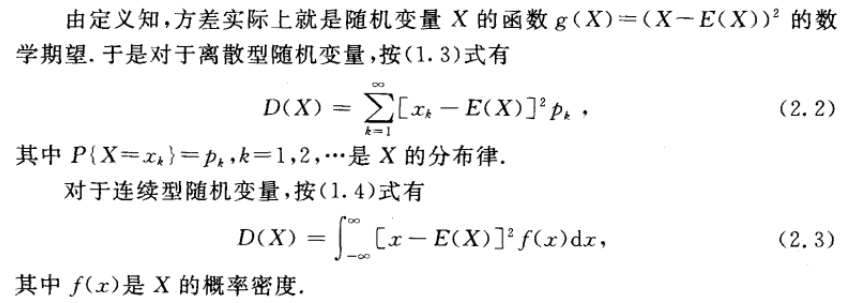

### 常用公式

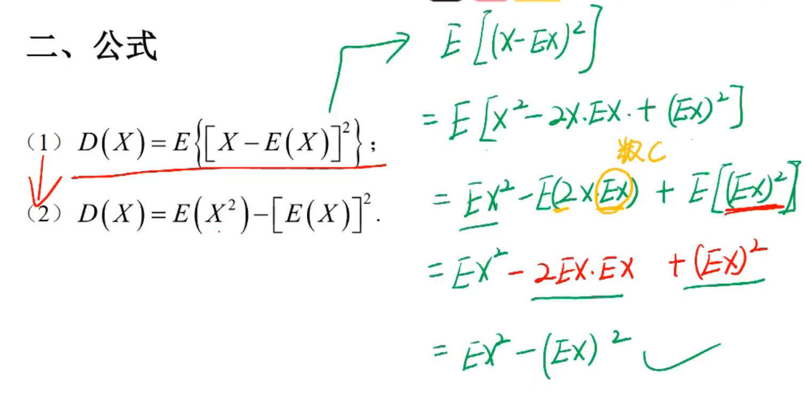

### 必看例题

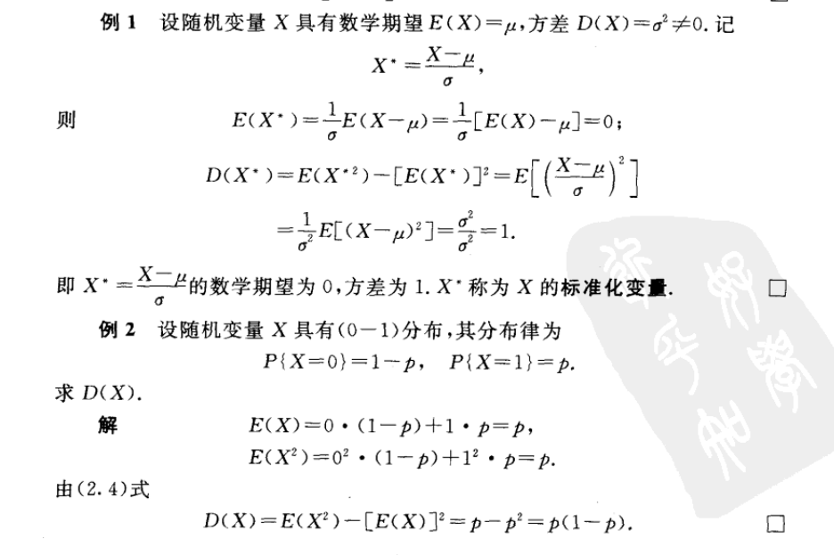

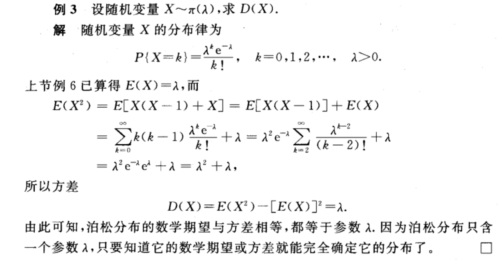

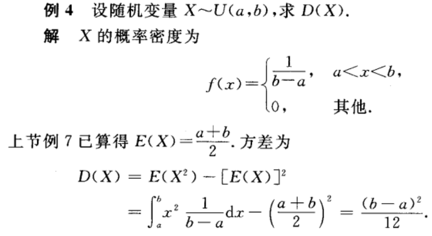

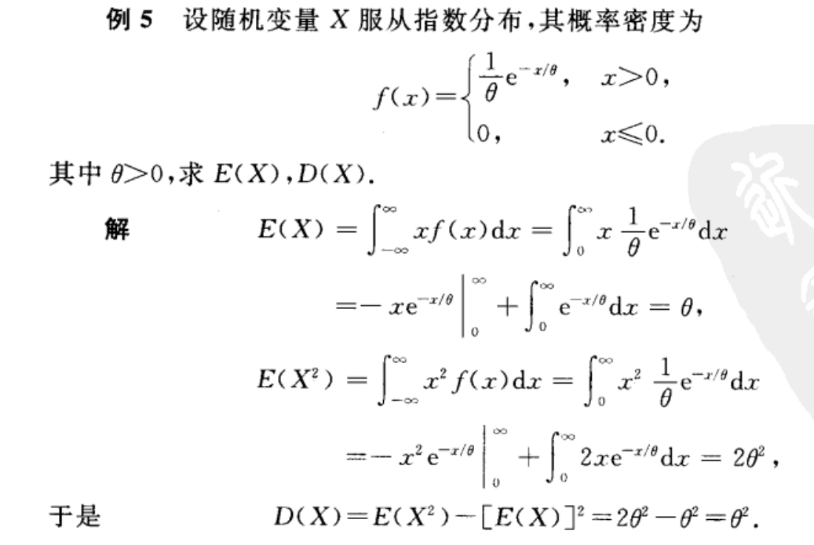

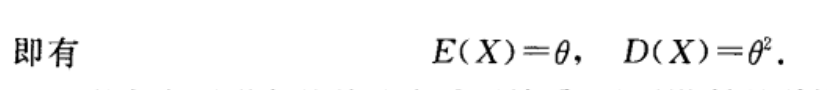

### 性质

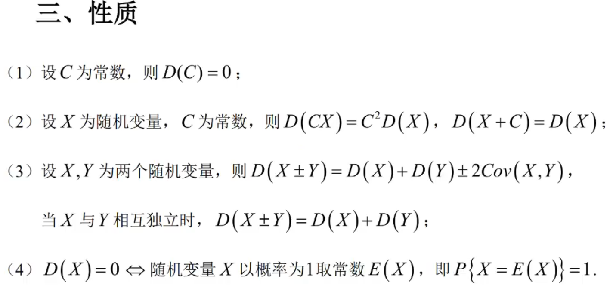

## 协方差

### 定义

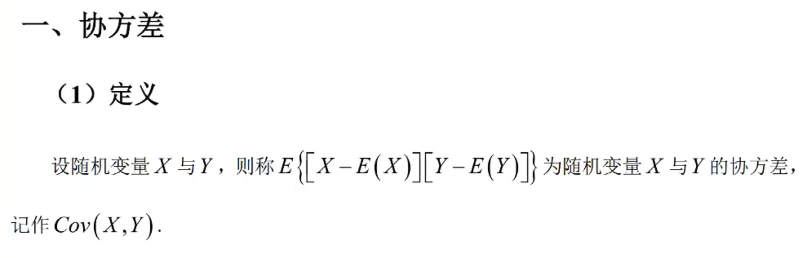

### 公式

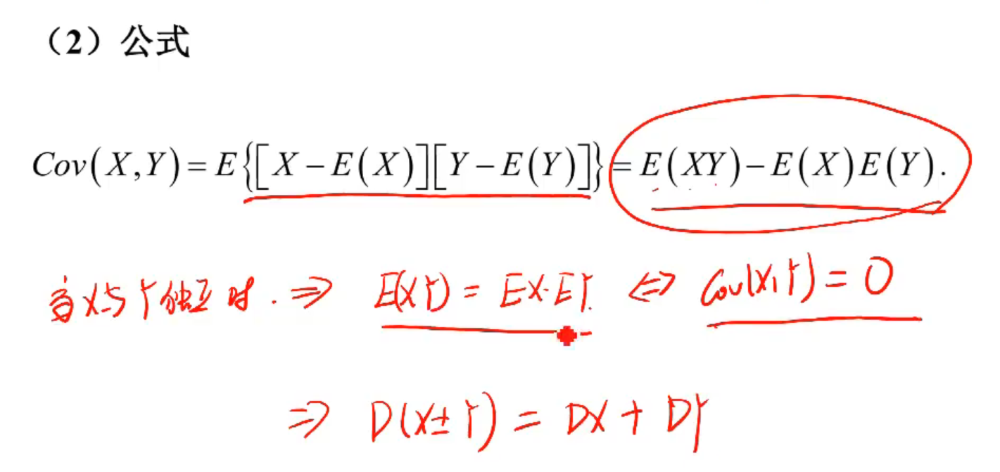

### 性质

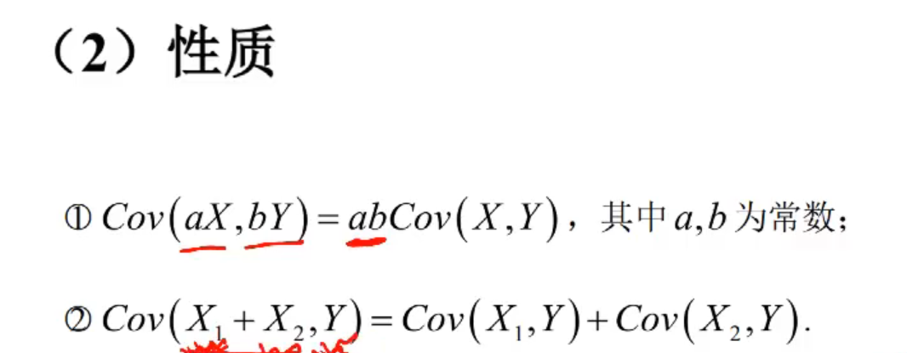

## 相关系数

### 定义

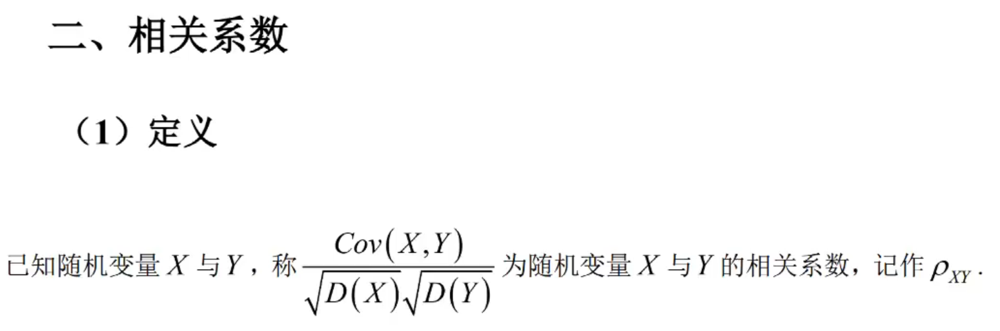

相关系数=协方差比上**标准差**的乘积

标准差是方差的开方

### 公式

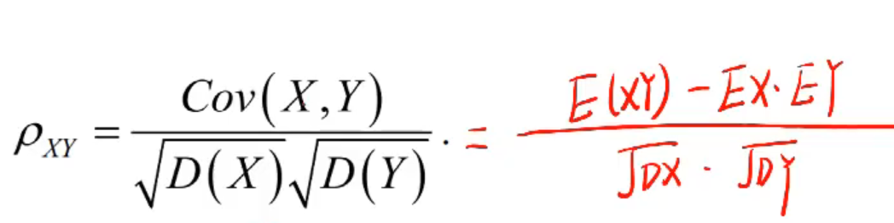

### 性质

看不懂，以后再说吧

