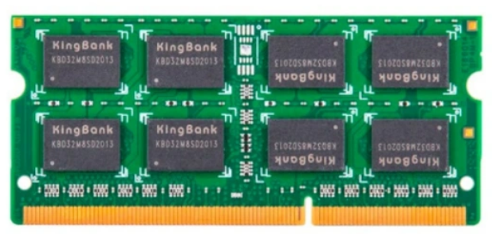
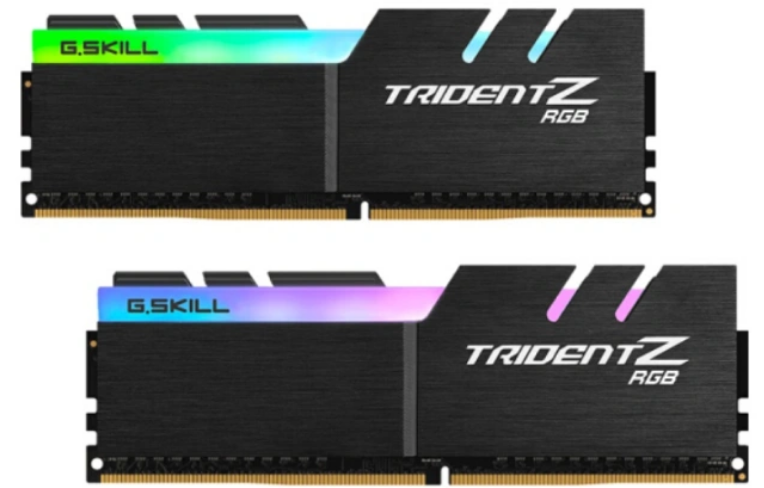

内存条该怎么选？

作者：陈先生
链接：https://www.zhihu.com/question/20557885/answer/420191090
来源：知乎
著作权归作者所有。商业转载请联系作者获得授权，非商业转载请注明出处。

这个就要从电脑运行的原理说起了，手机码字，所以就用通俗易懂的话简要回答了。CPU是大脑，负责电脑的计算工作，这点你肯定知道了。但是计算的数据哪里来呢？很明显，硬盘，数据都存储在硬盘里，你玩的游戏，工作用的文件都存储在硬盘里，在需要计算的时候，会把数据从硬盘中传送给CPU进行计算，然后给你返回结果。举个例子，硬盘里有一个文件，这个文件的内容是“计算99乘法表，1x1、2x2……”，当电脑执行这个文件的时候，会把这个文件内容告诉CPU，CPU便会进行计算，然后把结果通过输出设备展示给你。那么这里就有一个问题，CPU的计算能力已经很高，而硬盘的读取速率却差远了，因此CPU很多时候是在等待硬盘给它传送数据，这就造成CPU闲置，极大的浪费了计算资源。因此，我们需要一个高速存取的设备，能够尽可能的利用起CPU的计算能力，不要像硬盘一样因为过低的读取速度而造成资源浪费。而内存就是在做这部分工作。内存的存在，使得文件的传输过程由“硬盘—CPU”变为了“硬盘—内存—CPU”，假如一个8G的内存，在完全利用的情况下，可以直接缓存8G的硬盘数据，而由于内存的高速读取速度（可以达到硬盘速度的50倍左右），CPU可以高速的从内存中拿数据来进行计算，理想情况下，电脑的运行速度可以提高约50倍。这个理想情况是指CPU计算需要的数据刚好都缓存到内存里了，计算的时候只从内存读取就可以，但是经常会有这种情况：CPU计算需要的数据没缓存到内存，而是需要从硬盘中读取。这个时候会怎样？内存会去硬盘中找到这个数据，然后缓存起来，然后交给CPU使用，这个时候由于要从硬盘中读取数据，由于硬盘极低的速度，就会造成等待，对于人直观的感受就是电脑卡了一下。上面我只是说了大致过程，当然里面涉及的肯定要复杂的多，暂且不提，有兴趣可以自己去看下。然后说32G内存比8G内存好在哪里，这个时候你自己其实也明白了——它可以缓存32G的数据。而32G的时候基本可以满足你所有的数据需求，也就表示在你使用电脑的过程中，几乎不用再去硬盘中读取什么数据，仅仅依靠内存便可满足CPU的计算需要，这就表示电脑在运行中始终保持着“满速”！而如果是8G内存呢？以现在动辄几十G的游戏为例，在游戏运行的过程中，需要的数据很可能会超过8G，因此如果CPU需要的数据恰好不在内存中，那么就会造成卡顿，其实现在游戏的loading图，也就是动不动就出现“加载中”字样的时候，基本都是在缓存数据进内存，以防游戏中读取硬盘造成卡顿。这些基本可以说明白内存大的好处了，下面我要说一嘴其他的……就是各大电脑管家自带的“内存优化”，他会告诉你“内存用了70%，需要清理！”呵呵，我无法理解电脑为了提高运行速度，辛辛苦苦把数据加载到内存里，为什么要清理掉？就好比我买了个衣柜，每次衣柜放了差不多的时候，管家来告诉你“衣柜快满了，请把衣服都拿出来吧！”，然后你一点优化，管家把衣柜里的衣服全拿出来扔地上，然后你又辛苦的一件一件往衣柜里放，放个差不多，管家告诉你“衣柜快满了，请把衣服都拿出来吧！”……宛如一个智障。

知道了内存条的作用之后，选购内存条需要考虑以下内容：

[超详细！搞懂内存条颗粒频率时序，附DDR4内存条推荐 (zhihu.com)](https://www.zhihu.com/tardis/zm/art/225796443?source_id=1005)

内存最重要的元件——颗粒，就是下图中黑色的小方块。

内存颗粒是内存条最核心的部件，是内存的储存介质。内存颗粒也叫内存芯片，全名称叫：动态随机存取存储器（DRAM），属于易失性储存的一种。意思就是断电之后就会丢失数据，不会持久化保持。

部分内存还搭载着散热片，以提高内存的散热能力，部分内存还有RGB灯效。当然，搭载散热片和RGB灯效的内存价格肯定会比普条高一些。

内存的颗粒分为原片、白片、黑片三种，内存在生产的过程中会进行两次不同的检测。第一次检测是颗粒厂商行业规定的标准检测，第二次检测是颗粒厂商自己定制的检测规格，颗粒厂商制定的检测规则要比行业标准检测规则严格的多。当颗粒生产出来时，首先要进行的是行业标准检测，检测合格会进行下一项检测，下一项检测也合格，就会打上颗粒型号跟制造商logo进行售卖，这就是大家常说的原片。白片是第一项检测合格，第二项检测不合格，也会打上颗粒型号，但并不会打上颗粒制造商logo。如果遇到颗粒上的logo并不是三星、镁光、海力士的logo，那么这个颗粒就可能是白片。黑片，则是第一次检测就不合格，本应该报废处理，但总会被资本家通过各种方式和渠道流入市场。

颗粒作为内存上最重要的元件，选内存完全可以看成是选颗粒。同一家颗粒厂商生产的内存也有区别，不同的内存颗粒定位不同的消费市场。这些颗粒制造商通常喜欢用ABCDE-Die来区分体质，具体可以参照下图。

内存条有两个重要的参数：容量和频率。

容量大，内存条就可以缓存更多的数据，这样就能存放更多cpu可能需要用到的数据，减少cpu从硬盘加载数据到内存的概率，减少卡顿的发生，电脑能够更流畅。在我们玩大型游戏时也一样，如果内存容量小的话，在运行大型游戏的话，可能会导致cpu需要的数据不在内存中，需要再从硬盘加载数据从而造成游戏卡顿，因此，steam上的游戏会给出游戏运行的最低配置，其中一项就有运行内存的容量。

容量并不是越大越好，应该按照自己的需求购买，因为内存条并不是很便宜。举个例子，你如果用电脑来玩游戏，当你玩游戏的时候，看看内存的使用情况，如果内存没用完的话，说明你并不需要更大容量的内存，因为当前的内存已经能够缓存你玩的这个游戏的cpu所需要的全部数据，再大容量的内存并不能提高你游戏的流畅度，就没必要花冤枉钱买更大容量的内存了。

总结：如果你觉得自己的电脑有卡顿或玩游戏的时候有卡顿，看看内存的使用情况，按需购买；

频率

实际上，内存条是没有频率的。我们所说的内存频率其实是CPU对内存条访问的频率，CPU每访问一次，都会向内存条带来或带走一些数据。

CPU每秒访问内存的次数越多，对内存条的读写也就越快，实际上是对颗粒的读写。但内存颗粒每秒能承受的访问次数是有上限的。频率超过颗粒的承受上限，就会出现开不了机的情况。颗粒的承受上限是由内存条颗粒的体质决定的，体质好坏是天生的。

内存厂商会把体质好的颗粒做成高频内存，比如3000MHz、3200MHZ的内存；体质相对比较差的就做成低频内存，比如2400MHz、2666MHz等。

内存条上标注的频率并不是这根内存工作的频率，而是这根内存工作时能稳定承受的频率。主板厂商并不能自动识别你这条内存体质的好坏，所以主板厂商为了能够保证内存条能稳定工作，都会把内存的频率默认设置为2400MHz。买了高频内存的朋友，需要在主板BIOS中重新设置内存频率才能达到内存宣称的频率的。

